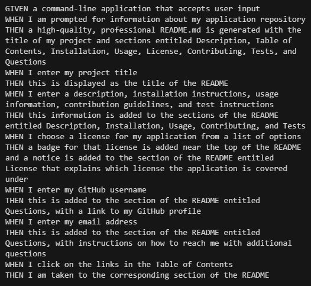

  # README Generator

  

  ## Description
  Create a command-line application that dynamically generates a professional README.md file from a user's input using the Inquirer package.
  Demo: https://screencast-o-matic.com/watch/c3enVpVbNrE 
  
  ## Table of Contents
  * [Description](#description)
  * [Installation](#installation)
  * [Usage](#usage)
  * [Screenshot](#screenshot)
  * [Credits](#credits)
  * [License](#license)

  ## Installation
  To run this project, node.js, NPM, and inquirer.js are needed
  
  ## Usage
  Live Link: https://mblackwellgca.github.io/READMEGenerator/ 
  Repo: https://github.com/mblackwellgca/READMEGenerator

  

  ## Credits
  Christopher Ponzio https://github.com/ChristopherPonzio 
  https://img.shields.io/badge/license 
  https://choosealicense.com/licenses 
  https://stackoverflow.com/ 
  https://www.w3schools.com/ 
  https://developer.mozilla.org/en-US/
  
  ## License
      Licensed under the MIT license.
      Copyright ©️ MIT. All rights reserved. 
      
  https://choosealicense.com/licenses/mit
  
